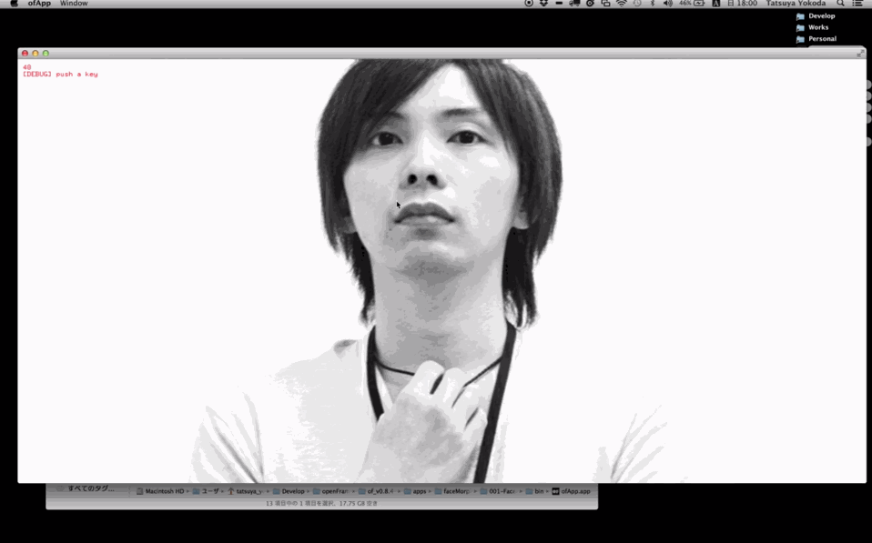

# Face morphing with openFrameworks

Description:
--------

http://labs.1-10.com/blog/facemorph-with-openframeworks.html

This is example morphing faces with oepnFrameworks.  
If you want to build the project, you need the following addons.

+ ofxFaceTracker
+ ofxOpenCv
+ ofxCv
+ ofxDelaunay

You need also some files for ofxFaceTracker in your /bin/data/model folder.

・face.con
・face.tracker
・face.tri
・face2.tracker

And also two images in your `openFrameworks/bin/data` folder.

+ face1.jpg
+ face2.jpg

(I'm using 640x480)

Requirements
--------
+ ofxFaceTracker
+ ofxOpenCv
+ ofxCv
+ ofxDelaunay
+ OpenFrameworks 084

Features:
--------

Updates:
--------
