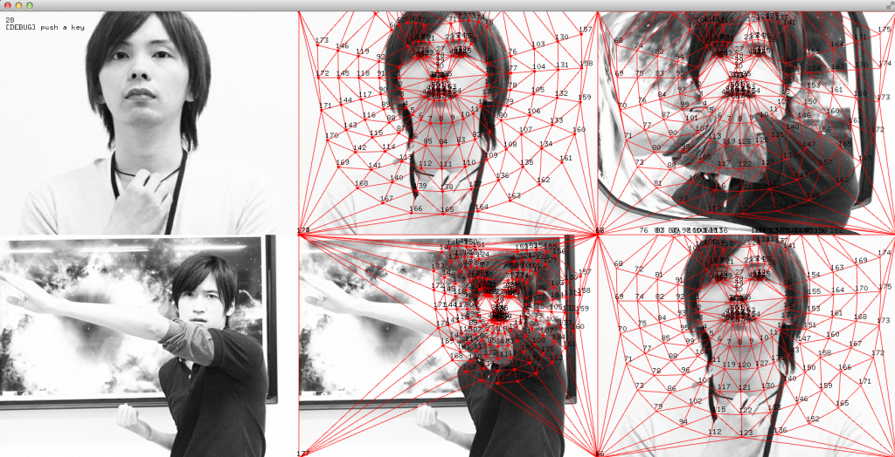

# Face morphing with openFrameworks

<iframe src="//player.vimeo.com/video/115956546" width="500" height="313" frameborder="0" webkitallowfullscreen mozallowfullscreen allowfullscreen></iframe> 
<a href="http://vimeo.com/115956546">face-morphing</a> from <a href="http://vimeo.com/110design">1&rarr;10design, Inc.</a> on <a href="https://vimeo.com">Vimeo</a>.

Description:
--------

http://labs.1-10.com/blog/facemorph-with-openframeworks.html

This is example morphing faces with oepnFrameworks.  
If you want to build the project, you need the following addons.

+ ofxFaceTracker
+ ofxOpenCv
+ ofxCv
+ ofxDelaunay

And you need also two images in your `openFrameworks/bin/data` folder.

+ face1.jpg
+ face2.jpg

Features:
--------
* OpenFrameworks 084 Examples!

Updates:
--------
